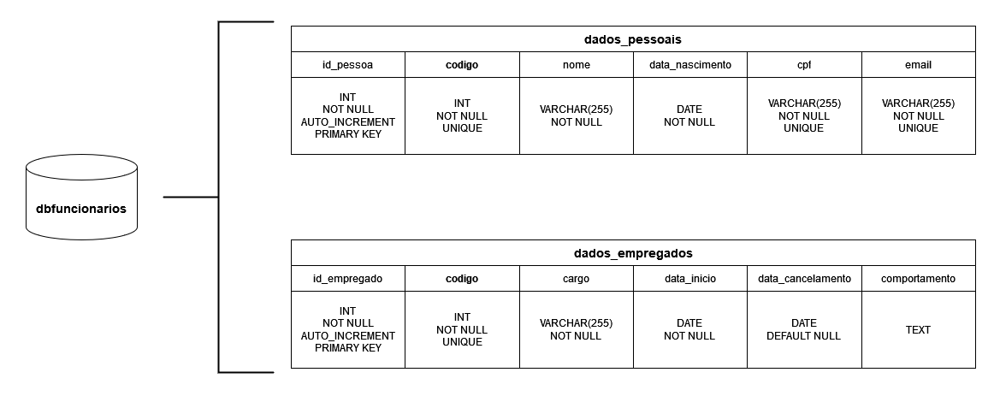

# Visão Geral

## RegistrosFuncionariosAPI 

Esta Interface de Programação de Aplicação (API) proporciona as 4 principais operações para **controlar 
registros de funcionários** em um banco de dados SGBD MySQL, o famoso _CRUD_.

> _Create - Operação para **cadastrar** um registro_

> _Read - Operação para **consultar** um registro_

> _Update - Operação para **modificar** um registro_

> _Delete - Operação para **anular** um registro_

---

## Rotas da API

Rotas (endpoint) para acesso à RegistrosFuncionariosAPI:

1. **Home**

    `URL` [https://registros-funcionarios-api.herokuapp.com](https://registros-funcionarios-api.herokuapp.com)

2. **Swagger/OpenAPI**

    `URL` [https://registros-funcionarios-api.herokuapp.com/docs](https://registros-funcionarios-api.herokuapp.com/docs)

    `URL` [https://registros-funcionarios-api.herokuapp.com/openapi.jsons](https://registros-funcionarios-api.herokuapp.com/openapi.json)

3. **Status**

    `URL` [https://registros-funcionarios-api.herokuapp.com/status](https://registros-funcionarios-api.herokuapp.com/status)

4. **Cadastros**

    `URL` [https://registros-funcionarios-api.herokuapp.com/funcionarios/cadastros](https://registros-funcionarios-api.herokuapp.com/funcionarios/cadastros)

5. **Consultas**

    `URL` [https://registros-funcionarios-api.herokuapp.com/funcionarios/consultas](https://registros-funcionarios-api.herokuapp.com/funcionarios/consultas)

6. **Modificações**

    `URL` [https://registros-funcionarios-api.herokuapp.com/funcionarios/modificacoes](https://registros-funcionarios-api.herokuapp.com/funcionarios/modificacoes)

7. **Anulações**

    `URL` [https://registros-funcionarios-api.herokuapp.com/funcionarios/anulacoes](https://registros-funcionarios-api.herokuapp.com/funcionarios/anulacoes)

---

## Compatibilidade da API

A RegistrosFuncionariosAPI utiliza do formatado [JSON](https://www.alura.com.br/artigos/o-que-e-json?gclid=Cj0KCQjwmdGYBhDRARIsABmSEePrXco4vblHC4vywuTu31zVXxDIZMZik2M_7Sm9iHTcAm_EUtxBgbAaAkWpEALw_wcB) para realizar as comunicações entre os sistemas, assim facilitando o tráfego de dados entre aplicações distintas e havendo um ponto em comum entre diversas linguagens de programação.

---

## Métodos da API

A API utiliza de 4 [métodos de requisição HTTP](https://developer.mozilla.org/pt-BR/docs/Web/HTTP/Methods) responsáveis por indicar as ações a serem executadas para um dado recurso.

> _POST - Método utilizado para  **criar** um recurso_

> _GET - Método utilizado para  **pegar** um recurso_

> _PATCH - Método utilizado para  **atualizar uma parte** de um recurso_

> _DELETE - Método utilizado para  **excluir** um recurso_

---

## Banco de Dados Desenvolvido para a API

### Estrutura do Banco de Dados

A estruturação do banco de dados foi criada para receber os principais dados dos funcionários, como mostrado na tabela abaixo:

Dados do funcionário      | Obrigatoriedade | 
---------                 | :------:
Código de identificação   | ✔️
Nome                      | ✔️
Data de nascimento        | ✔️
CPF                       | ✔️
Email                     | ✔️
Cargo                     | ✔️
Data de início ou entrada | ✔️
Data de cancelamento      | Aceita valor NULL
Comportamento             | Aceita string vazia  

---

### Modelagem do Banco de Dados

A API integra com um banco de dados SGBD MySQL hospedado e modelado unicamente para está aplicação.

A imagem a seguir exibe mais detalhamento da modelagem implementada:

---