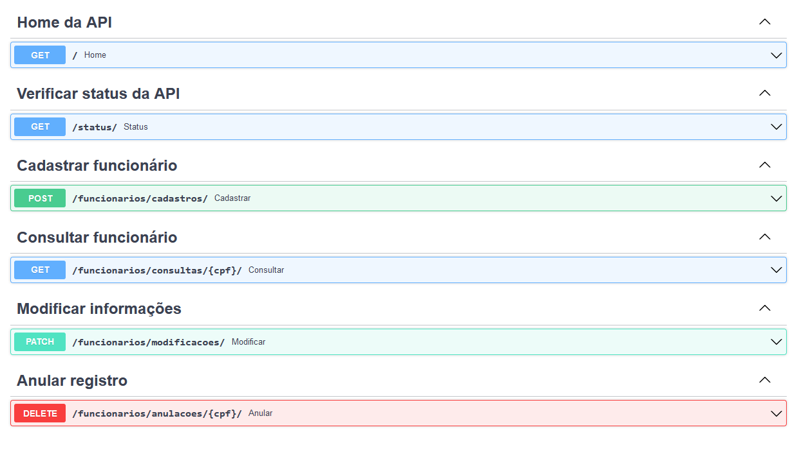
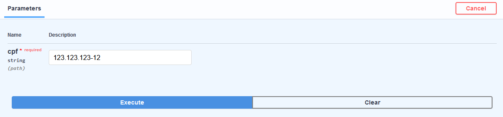
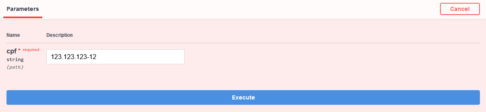

# Testar API

> "Tá bom, tá bom... já entendi, mais só queria testar aqui rapidinho mesmo para matar a curiosidade, como faço?", disse Alguém.

---

## Como testar a RegistrosFuncionariosApi

Primeiramente, para realizar os testes na API rapidamente e de maneira intuitiva, acesse o link abaixo:

🖱️ [https://registros-funcionarios-api.luishperna.com.br/docs](https://registros-funcionarios-api.luishperna.com.br/docs)

Após o carregamento da página, será possível acessar as rotas da API para testá-las, como mostrado na imagem a seguir:



Escolha uma das operações mostradas no qual deseja executar.

---

### Operações da API

Clique na operação escolhida e siga a orientação abaixo correspondente a sua escolha.

#### 👀 Home da API

Para testar essa operação basta clicar em **Try it out** e posteriormente em **Execute**.

O retorno será um `JSON` contento as informações sobre a API, como o mostrado abaixo:

``` json
{
  "Aplicação": "Web/API",
  "Projeto": "RegistrosFuncionariosApi",
  "Usabilidade": "Operações CRUD de registros de funcionários no banco de dados",
  "Documentação": "https://registros-funcionarios-api-docs.luishperna.com.br",
  "Rotas": {
    "/": "Método GET - Home da API",
    "/docs": "Swagger UI da API",
    "/openapi.json": "OpenAPI da API",
    "/status": "Método GET - Status da API",
    "/funcionarios/cadastros": "Método POST - Cadastrar um registro",
    "/funcionarios/consultas/{cpf}": "Método GET - Consultar um registro",
    "/funcionarios/modificacoes": "Método PATCH - Modificar um registro",
    "/funcionarios/anulacoes/{cpf}": "Método DELETE - Anular um registro"
  },
  "Finalidade": "Simulação/Estudo",
  "Desenvolvedor": "Luís Henrique Perna"
}
```

---

#### ✅ Verificar status da API

Para testar essa operação basta clicar em **Try it out** e posteriormente em **Execute**.

O retorno será um `JSON` informando se a API está rodando, como o mostrado abaixo:

``` json
{
  "Status": "API rodando"
}
```

---

#### ✏️ Cadastrar funcionário

Para testar essa operação clique em **Try it out**, no campo Request body aparecerá o seguinte `JSON`:

``` json
{
  "nome": "string",
  "data_nascimento": "string",
  "cpf": "string",
  "email": "string",
  "codigo": 0,
  "cargo": "string",
  "data_inicio": "string",
  "data_cancelamento": "string",
  "comportamento": "string"
}
```

Altere os valores das chaves, seguindo a [Indicação ao Inserir Dados Falsos](./guide/index.md#indicação-ao-inserir-dados-falsos).

Atente-se também a [Aceitação de valores duplicados](./index.md#estrutura-do-banco-de-dados) da Estrutura do Banco de Dados.

Exemplo:

``` json
{
  "nome": "Peter Jason Quill",
  "data_nascimento": "1980-12-20",
  "cpf": "123.123.123-12",
  "email": "perterquill@gmail.com",
  "codigo": 2201,
  "cargo": "Desenvolvedor Web",
  "data_inicio": "2022-09-07",
  "data_cancelamento": "NULL",
  "comportamento": "Proativo"
}
```

O retorno será um `JSON` informando se o cadastro foi realizado com sucesso ✔️

``` json
{
  "Status": "Cadastrado realizado com sucesso!",
  "Funcionário(a)": "Peter Jason Quill",
  "Código": "2201"
}
```

Ou se houve algum tipo de erro ❌

``` json
{
  "Status": "Erro ao cadastrar",
  "Tipo de erro": "1062 (23000): Duplicate entry '2201' for key 'dados_pessoais.codigo'",
  "Causas": "Dados duplicados, faltantes ou incorretos"
}
```

---

#### 🔎 Consultar funcionário

Para testar essa operação clique em **Try it out**, no campo Parameters digite um CPF já cadastrado no sistema, exemplo:



Após clicar em **Execute**, o retorno será um `JSON` contendo as informações do funcionário correspondente ao CPF ✔️

``` json
{
  "codigo": "2201",
  "nome": "Peter Jason Quill",
  "data_nascimento": "1980-12-20",
  "cpf": "123.123.123-12",
  "email": "perterquill@gmail.com",
  "cargo": "Desenvolvedor Web",
  "data_inicio": "2022-09-07",
  "data_cancelamento": "None",
  "comportamento": "Proativo"
}
```

Caso haver erro ao consultar o retorno será um `JSON` informando o de erro ❌

``` json
{
  "Status": "Erro ao consultar",
  "Tipo de erro": "CPF incorreto ou não cadastrado"
}
```

---

#### 🔧 Modificar informações

Para testar essa operação clique em **Try it out**, no campo Request body aparecerá o seguinte `JSON`:

``` json
{
  "codigo": 0,
  "atributo": "string",
  "novo_valor": "string"
}
```

Altere os valores das chaves, seguindo a [Indicação ao Inserir Dados Falsos](./guide/index.md#indicação-ao-inserir-dados-falsos).

Atente-se também a [Aceitação de valores duplicados](./index.md#estrutura-do-banco-de-dados) da Estrutura do Banco de Dados.

Exemplo:

``` json
{
  "codigo": 2201,
  "atributo": "data_inicio",
  "novo_valor": "2022-09-12"
}
```

O retorno será um `JSON` informando se a modificação foi realizado com sucesso ✔️

``` json
{
  "Status": "2201 - Modificação realizado com sucesso!",
  "Atualização": "Atributo data_inicio setado para 2022-09-12"
}
```

Ou se houve algum tipo de erro ❌

``` JSON
# Erro ao tentar modificar um atributo não permitido
{
  "Status": "Erro ao modificar",
  "Tipo de erro": "O atributo codigo não pode ser modificado"
}

# Erro ao informar um atributo ou valor incorretamente
{
  "Status": "Erro ao modificar",
  "Tipo de erro": "1054 (42S22): Unknown column 'dat_inicio' in 'field list'",
  "Causas": "Dados faltantes ou incorretos"
}
```

---

#### 🧹 Anular registro

Para testar essa operação clique em **Try it out**, no campo Parameters digite um CPF que deseja anular o registro no sistema, exemplo:



O retorno será um `JSON` informando se a anulação do registro foi realizado com sucesso ✔️

``` json
{
  "Status": "Anulação realizada com sucesso!",
  "Anulação": "Deletado registro com CPF 123.123.123-12"
}
```

!!! note "Observação"

    A resposta será a mesma caso o CPF não esteja registrado. 

---